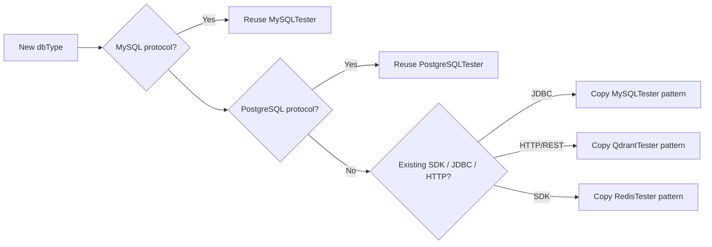

# DBClient: Add a New Engine

## Decision Tree



## Path 1: Reuse an Existing Tester

If the new engine speaks MySQL or PostgreSQL protocol, you usually only need to register an alias and add the driver dependency.

Example for a MySQL-compatible engine named `foomysql`:

1. In `TesterFactory.java`:
   ```java
   case "foomysql":
       return new MySQLTester(config);
   ```
2. In `DBConfig.java` whitelist:
   ```java
   case "foomysql":
   ```
3. In `build.gradle`:
   ```groovy
   implementation 'com.example:foo-mysql-driver:1.0.0'
   ```
4. Add a note to `dbclient-engine-relational/SKILL.md`.

## Path 2: Add a New Tester

### Choose a Reference Implementation

| Protocol / Client Type | Reference Tester | Why |
|---|---|---|
| JDBC | `MySQLTester.java` | Clean `DatabaseConnection` + `ResultSet` pattern |
| HTTP/REST JSON | `QdrantTester.java` | Uses Apache HttpClient and Jackson parsing |
| SDK client | `RedisTester.java` | Pool-based client lifecycle |
| Document store | `MongoDBTester.java` | Custom `QueryResult` subclass (`MongoDBResult`) |

### Minimum Implementation Order

Implement only what you need for the first smoke test, in this order:

1. `connect()` + a private `DatabaseConnection` subclass.
2. `execute()` + a `QueryResult` that carries either a `ResultSet`, raw results, or update count.
3. `releaseConnections()`.
4. `executeTest()` (just return `TestExecutor.executeTest(this, dbConfig)`).
5. After query works, add `connectionStress()`.
6. Add `bench()` and `executionLoop()` only if required.

### Registration Checklist

| # | File | Change |
|---|---|---|
| 1 | `src/main/java/com/apecloud/dbtester/tester/XxxTester.java` | New Tester with `DatabaseTester` implementation |
| 2 | `src/main/java/com/apecloud/dbtester/commons/TesterFactory.java` | Add dbType aliases in the switch |
| 3 | `src/main/java/com/apecloud/dbtester/commons/DBConfig.java` | Add the same aliases to `validate()` whitelist |
| 4 | `build.gradle` | Add Maven dependency or local jar |
| 5 | `skills/dbclient-engine-*/SKILL.md` | Add engine row and dependency note |

Reminder: keep the alias lists in #2 and #3 identical, otherwise `config.build()` will fail with `Unsupported database type`.

## Dependency Notes

- Prefer Maven Central coordinates in `build.gradle`.
- If you must use a local jar, place it under `libs/` and reference it as:
  ```groovy
  implementation files('libs/xxx-client.jar')
  ```
- Exclude conflicting transitive dependencies when needed (see Hive example in `dbclient-engine-storage`).
- `shadowJar` already excludes signature files and merges service files; verify with:
  ```bash
  jar tf build/libs/oneclient-1.0-all.jar | grep -i xxx
  ```

## Smoke Test Sequence

```bash
# Build
gradle shadowJar

# 1. Query smoke test
java -jar build/libs/oneclient-1.0-all.jar \
  -h 127.0.0.1 -P <port> -u <user> -p <pass> -d <db> \
  -e xxx -t query -q "<minimal query>"

# 2. Connection stress smoke test
java -jar build/libs/oneclient-1.0-all.jar \
  -h 127.0.0.1 -P <port> -u <user> -p <pass> \
  -e xxx -t connectionstress -c 50 -s 10

# 3. Benchmark smoke test
java -jar build/libs/oneclient-1.0-all.jar \
  -h 127.0.0.1 -P <port> -u <user> -p <pass> -d <db> \
  -e xxx -t benchmark -q "<minimal query>" -i 1000 -m 10
```

## Result Formatting

If your engine returns something other than a JDBC `ResultSet`, check whether `TestExecutor.formatQueryResult()` needs a new branch:

- JSON documents -> look at `mongodb` branch
- Raw string list -> look at `redis` branch
- REST response column -> look at `qdrant` branch

## Maintenance Notes
- When adding a new engine family, consider creating a new `dbclient-engine-<family>` skill.
- When the new engine fits an existing family, update that family skill instead of duplicating notes.
